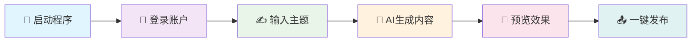

<div align="center">

# 🌟 小红书AI发布助手 🌟


<br/>


<br/>


<br/><br/>

<h2>🎨 智能内容创作 • 🤖 AI驱动 • 📱 一键发布</h2>

<div style="display: flex; justify-content: center; gap: 20px; margin: 20px 0;">
  <a href="./readme.md">
    
  </a>
  <a href="./readme_en.md">
    
  </a>
</div>

<br/>


<br/><br/>

<div style="background: linear-gradient(135deg, #667eea 0%, #764ba2 100%); padding: 20px; border-radius: 15px; margin: 20px 0;">
  <h3 style="color: white; margin: 0;">✨ 让内容创作变得简单而高效 ✨</h3>
  <p style="color: #f0f0f0; margin: 10px 0 0 0;">基于先进AI技术，为内容创作者提供全流程自动化解决方案</p>
</div>

</div>

---

<div align="center">

## 📖 项目简介


<br/><br/>

**小红书AI发布助手** 是一个功能强大的自动化内容创作与发布工具，为内容创作者提供全流程自动化解决方案。

</div>

<div align="center">

### 🎯 核心价值

<table>
<tr>
<td align="center" width="25%">
<br/>
<sub>基于先进AI技术<br/>自动生成高质量内容</sub>
</td>
<td align="center" width="25%">
<br/>
<sub>一键操作<br/>节省90%发布时间</sub>
</td>
<td align="center" width="25%">
<br/>
<sub>精美界面设计<br/>用户体验极佳</sub>
</td>
<td align="center" width="25%">
<br/>
<sub>从内容生成到发布<br/>全流程自动化</sub>
</td>
</tr>
</table>

</div>

---

<div align="center">

## ✨ 核心功能


</div>

<table>
<tr>
<td width="50%">

### 🤖 AI智能生成
- 🎯 **智能标题**：AI生成吸引人的标题
- 📝 **内容创作**：基于主题自动生成文章
- 🖼️ **图片处理**：智能匹配和处理图片
- 🏷️ **标签推荐**：自动推荐热门标签

</td>
<td width="50%">

### 🚀 自动化发布
- 📱 **一键登录**：支持手机号快速登录
- 📋 **内容预览**：发布前完整预览效果
- ⏰ **定时发布**：支持定时任务发布
- 💾 **状态保存**：自动保存登录状态

</td>
</tr>
<tr>
<td width="50%">

### 👥 用户管理
- 🔄 **多账户**：支持多个小红书账户管理
- 🌐 **代理配置**：支持代理服务器配置
- 🔍 **浏览器指纹**：防检测浏览器指纹
- 📊 **数据统计**：发布数据统计分析

</td>
<td width="50%">

### 🛡️ 安全稳定
- 🔐 **数据加密**：本地数据安全加密存储
- 🛡️ **反检测**：先进的反检测技术
- 📝 **日志记录**：完整的操作日志记录
- 🔄 **错误恢复**：智能错误处理和恢复

</td>
</tr>
</table>

---

<div align="center">

## 📁 项目架构


</div>

```
📦 xhs_ai_publisher/
├── 📂 src/                          # 🔧 源代码目录
│   ├── 📂 core/                     # ⚡ 核心功能模块
│   │   ├── 📂 models/               # 🗄️ 数据模型
│   │   ├── 📂 services/             # 🔧 业务服务层
│   │   ├── 📂 pages/                # 🎨 界面页面
│   │   ├── 📂 browser/              # 🌐 浏览器自动化
│   │   └── 📂 utils/                # 🛠️ 工具函数
│   ├── 📂 web/                      # 🌐 Web接口
│   │   ├── 📂 templates/            # 📄 HTML模板
│   │   └── 📂 static/               # 🎨 静态资源
│   └── 📂 logger/                   # 📝 日志系统
├── 📂 ai_publish_google_shop/       # 🏪 Chrome扩展
├── 📂 test/                         # 🧪 测试目录
├── 📂 build/                        # 📦 构建输出
├── 🐍 main.py                       # 🚀 主程序入口
├── 📋 requirements.txt              # 📦 依赖包列表
└── 📖 README.md                     # 📚 项目说明
```

---

<div align="center">

## 🛠️ 快速开始


### 📋 环境要求

</div>

<div align="center">

| 组件 | 版本要求 | 说明 |
|:---:|:---:|:---:|
| 🐍 **Python** | `3.9+` | 推荐使用最新版本 |
| 🌐 **Chrome** | `最新版` | 用于浏览器自动化 |
| 💾 **内存** | `4GB+` | 推荐8GB以上 |
| 💿 **磁盘** | `2GB+` | 用于存储依赖和数据 |

</div>

<div align="center">

### 🚀 安装步骤

</div>

<details>
<summary>📥 <strong>方式一：源码安装（推荐开发者）</strong></summary>

```bash
# 1️⃣ 克隆项目
git clone https://github.com/yourusername/xhs_ai_publisher.git
cd xhs_ai_publisher

# 2️⃣ 创建虚拟环境（推荐）
python -m venv venv
source venv/bin/activate  # Linux/Mac
# 或
venv\Scripts\activate     # Windows

# 3️⃣ 安装依赖
pip install -r requirements.txt

# 4️⃣ 安装浏览器驱动
playwright install chromium

# 5️⃣ 初始化数据库
python src/core/database_init.py init

# 6️⃣ 启动程序
python main.py
```

</details>

<details>
<summary>📦 <strong>方式二：可执行程序（推荐普通用户）</strong></summary>

<div align="center">

### 🎯 一键下载，即开即用

<a href="https://pan.baidu.com/s/1rIQ-ZgyHYN_ncVXlery4yQ">

</a>

**提取码：** `iqiy`

</div>

**使用步骤：**
1. 📥 下载并解压压缩包
2. 🚀 双击运行 `easy_ui.exe`
3. 🎯 按照界面提示操作即可

**注意事项：**
- ✅ 仅支持 Windows 10/11 系统
- ⏱️ 首次运行需要等待加载（约30-60秒）
- 🛡️ 如遇杀毒软件报警，请添加信任

</details>

---

<div align="center">

## 📱 使用指南


### 🎯 基础使用流程

</div>

<div align="center">



</div>

<div align="center">

### 📝 详细操作步骤


</div>

<table>
<tr>
<td width="50%">

**1. 🚀 启动程序**
- 运行 `python main.py` 或双击可执行文件
- 等待程序加载完成

**2. 👤 用户管理**
- 点击"用户管理"按钮
- 添加新用户或切换现有用户
- 配置代理和浏览器指纹（可选）

**3. 📱 账户登录**
- 输入手机号码
- 接收并输入验证码
- 系统自动保存登录状态

</td>
<td width="50%">

**4. ✍️ 内容创作**
- 在主题输入框输入创作主题
- 点击"生成内容"按钮
- AI自动生成标题和内容

**5. 🖼️ 图片处理**
- 系统自动匹配相关图片
- 可手动上传自定义图片
- 支持多图片批量处理

**6. 👀 预览发布**
- 点击"预览发布"查看效果
- 确认内容无误后点击发布
- 支持定时发布功能

</td>
</tr>
</table>

---

## 🎨 界面预览


<div align="center">

### 📱 主要界面展示

<table>
<tr>
<td align="center">

<br/>

<br/>
<sub>💡 简洁直观的主操作界面</sub>
</td>
<td align="center">

<br/>

<br/>
<sub>👥 多账户管理，代理配置</sub>
</td>
</tr>
<tr>
<td align="center">

<br/>

<br/>
<sub>🎯 AI智能内容创作</sub>
</td>
<td align="center">

<br/>

<br/>
<sub>👀 发布前预览效果</sub>
</td>
</tr>
</table>

### 🎬 软件演示


<br/>

**✨ 完整的操作流程演示，从登录到发布一气呵成**

</div>

---

## 🔧 高级配置


### ⚙️ 配置文件说明

<details>
<summary>📁 <strong>config.py - 主配置文件</strong></summary>

```python
# AI配置
AI_CONFIG = {
    "model": "gpt-3.5-turbo",
    "max_tokens": 2000,
    "temperature": 0.7
}

# 浏览器配置
BROWSER_CONFIG = {
    "headless": False,
    "user_agent": "Mozilla/5.0...",
    "viewport": {"width": 1920, "height": 1080}
}

# 发布配置
PUBLISH_CONFIG = {
    "auto_publish": False,
    "delay_range": [3, 8],
    "max_retry": 3
}
```

</details>

<div align="center">

### 🌐 代理配置

<table>
<tr>
<td align="center" width="25%">

</td>
<td align="center" width="25%">

</td>
<td align="center" width="25%">

</td>
<td align="center" width="25%">

</td>
</tr>
</table>

</div>

---

<div align="center">

## 📊 开发路线图


</div>

<table>
<tr>
<td width="50%">

### ✅ 已完成功能
- [x] 🎯 **基础功能**：内容生成和发布
- [x] 👥 **用户管理**：多账户支持
- [x] 🌐 **代理配置**：网络代理支持
- [x] 🛡️ **安全防护**：反检测机制
- [x] 📱 **界面优化**：现代化UI设计

</td>
<td width="50%">

### 🔄 开发中功能
- [ ] 📚 **内容库**：素材管理系统
- [ ] 🎨 **模板库**：预设模板系统
- [ ] 📊 **数据分析**：发布效果分析
- [ ] 🔌 **API接口**：开放API接口
- [ ] 📱 **移动端**：手机端支持

</td>
</tr>
</table>

---

<div align="center">

## 🤝 参与贡献


**🎉 我们欢迎所有形式的贡献！**

</div>

<div align="center">

### 🚀 贡献方式

<table>
<tr>
<td align="center" width="25%">
<br/>
<sub>发现并修复程序错误</sub>
</td>
<td align="center" width="25%">
<br/>
<sub>添加新功能和改进</sub>
</td>
<td align="center" width="25%">
<br/>
<sub>完善项目文档</sub>
</td>
<td align="center" width="25%">
<br/>
<sub>编写测试代码</sub>
</td>
</tr>
</table>

</div>

### 📝 贡献步骤

1. **🍴 Fork 项目**
   ```bash
   git clone https://github.com/yourusername/xhs_ai_publisher.git
   ```

2. **🌿 创建分支**
   ```bash
   git checkout -b feature/your-feature-name
   ```

3. **💻 提交更改**
   ```bash
   git commit -m "✨ Add: 新功能描述"
   ```

4. **📤 推送分支**
   ```bash
   git push origin feature/your-feature-name
   ```

5. **🔄 创建 Pull Request**

---

<div align="center">

## 📄 许可证


本项目采用 [Apache 2.0](./LICENSE) 许可证

</div>

---

<div align="center">

## 💖 支持项目


<br/>

<a href="https://github.com/yourusername/xhs_ai_publisher">

</a>

<br/><br/>

**💝 您的支持是我们持续开发的动力！**

</div>

<table>
<tr>
<td align="center">
<br/>
<sub>GitHub 点星支持</sub>
</td>
<td align="center">
<br/>
<sub>分享给更多人</sub>
</td>
<td align="center">
<br/>
<sub>提交Issue反馈</sub>
</td>
<td align="center">
<br/>
<sub>功能建议和改进</sub>
</td>
</tr>
</table>

---

<div align="center">

## 📞 联系我们


<br/>

### 💬 多种联系方式

<table>
<tr>
<td align="center" width="33%">

<br/><br/>

<br/>
<sub>🔍 扫码添加微信好友</sub>
</td>
<td align="center" width="33%">

<br/><br/>

<br/>
<sub>📢 关注公众号获取最新动态</sub>
</td>
<td align="center" width="33%">

<br/><br/>
<a href="https://github.com/yourusername/xhs_ai_publisher/issues">

</a>
<br/>
<sub>🔧 技术问题和Bug反馈</sub>
</td>
</tr>
</table>

<br/>


<br/>

**群号：123456789**

<br/>

🎯 **在这里您可以：**
- 💡 获取使用技巧和最佳实践
- 🐛 反馈问题并获得快速解答  
- 🚀 第一时间了解新功能更新
- 🤝 与其他用户交流经验心得

</div>

<br/>

**🤝 期待与您的交流合作！**

---

<div style="background: linear-gradient(135deg, #667eea 0%, #764ba2 100%); padding: 30px; border-radius: 20px; margin: 30px 0;">
  <h3 align="center" style="color: white; margin: 0;">🌟 感谢您的关注和支持！🌟</h3>
  <p align="center" style="color: #f0f0f0; margin: 15px 0 0 0;">让我们一起打造更好的内容创作工具</p>
</div>
