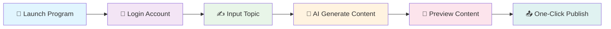

# 🌟 Xiaohongshu AI Publisher

<div align="center">


<br/>


<br/><br/>

<h3>🎨 Smart Content Creation • 🤖 AI-Powered • 📱 One-Click Publishing</h3>

[🇨🇳 简体中文](./readme.md) | [🇺🇸 English](./readme_en.md)

<br/>


</div>

---

## 📖 Project Overview

> **Xiaohongshu AI Publisher** is a powerful automated content creation and publishing tool, specifically designed for content creators on the Xiaohongshu platform.

🎯 **Core Values**
- 🧠 **Smart Creation**: Generate high-quality content with advanced AI technology
- ⚡ **Efficiency Boost**: One-click operation saves 90% of publishing time
- 🎨 **Professional Quality**: Beautiful interface design with excellent user experience
- 🔧 **Complete Features**: Full automation from content generation to publishing

---

## ✨ Core Features

<table>
<tr>
<td width="50%">

### 🤖 AI Smart Generation
- 🎯 **Smart Titles**: AI-generated engaging titles
- 📝 **Content Creation**: Auto-generate articles based on topics
- 🖼️ **Image Processing**: Smart image matching and processing
- 🏷️ **Tag Recommendations**: Auto-recommend trending tags

</td>
<td width="50%">

### 🚀 Automated Publishing
- 📱 **One-Click Login**: Quick login with phone number
- 📋 **Content Preview**: Complete preview before publishing
- ⏰ **Scheduled Publishing**: Support for timed publishing
- 💾 **State Saving**: Auto-save login status

</td>
</tr>
<tr>
<td width="50%">

### 👥 User Management
- 🔄 **Multi-Account**: Support multiple Xiaohongshu accounts
- 🌐 **Proxy Configuration**: Support proxy server configuration
- 🔍 **Browser Fingerprints**: Anti-detection browser fingerprints
- 📊 **Data Analytics**: Publishing data statistics and analysis

</td>
<td width="50%">

### 🛡️ Security & Stability
- 🔐 **Data Encryption**: Secure local data encryption storage
- 🛡️ **Anti-Detection**: Advanced anti-detection technology
- 📝 **Logging**: Complete operation logging
- 🔄 **Error Recovery**: Smart error handling and recovery

</td>
</tr>
</table>

---

## 📁 Project Architecture

```
📦 xhs_ai_publisher/
├── 📂 src/                          # 🔧 Source Code Directory
│   ├── 📂 core/                     # ⚡ Core Functionality Modules
│   │   ├── 📂 models/               # 🗄️ Data Models
│   │   ├── 📂 services/             # 🔧 Business Service Layer
│   │   ├── 📂 pages/                # 🎨 UI Pages
│   │   ├── 📂 browser/              # 🌐 Browser Automation
│   │   └── 📂 utils/                # 🛠️ Utility Functions
│   ├── 📂 web/                      # 🌐 Web Interface
│   │   ├── 📂 templates/            # 📄 HTML Templates
│   │   └── 📂 static/               # 🎨 Static Resources
│   └── 📂 logger/                   # 📝 Logging System
├── 📂 ai_publish_google_shop/       # 🏪 Chrome Extension
├── 📂 test/                         # 🧪 Test Directory
├── 📂 build/                        # 📦 Build Output
├── 🐍 main.py                       # 🚀 Main Program Entry
├── 📋 requirements.txt              # 📦 Dependencies List
└── 📖 README.md                     # 📚 Project Documentation
```

---

## 🛠️ Quick Start

### 📋 System Requirements

<div align="center">

| Component | Version | Description |
|:---:|:---:|:---:|
| 🐍 **Python** | `3.9+` | Latest version recommended |
| 🌐 **Chrome** | `Latest` | For browser automation |
| 💾 **Memory** | `4GB+` | 8GB+ recommended |
| 💿 **Storage** | `2GB+` | For dependencies and data |

</div>

### 🚀 Installation Methods

<details>
<summary>📥 <strong>Method 1: Source Installation (Recommended for Developers)</strong></summary>

```bash
# 1️⃣ Clone the repository
git clone https://github.com/yourusername/xhs_ai_publisher.git
cd xhs_ai_publisher

# 2️⃣ Create virtual environment (recommended)
python -m venv venv
source venv/bin/activate  # Linux/Mac
# or
venv\Scripts\activate     # Windows

# 3️⃣ Install dependencies
pip install -r requirements.txt

# 4️⃣ Install browser drivers
playwright install chromium

# 5️⃣ Initialize database
python src/core/database_init.py init

# 6️⃣ Start the program
python main.py
```

</details>

<details>
<summary>📦 <strong>Method 2: Executable Program (Recommended for General Users)</strong></summary>

<div align="center">

### 🎯 One-Click Download, Ready to Use

<a href="https://pan.baidu.com/s/1rIQ-ZgyHYN_ncVXlery4yQ">

</a>

**Extraction Code:** `iqiy`

</div>

**Usage Steps:**
1. 📥 Download and extract the archive
2. 🚀 Double-click to run `easy_ui.exe`
3. 🎯 Follow the interface prompts

**Important Notes:**
- ✅ Windows 10/11 systems only
- ⏱️ First run may take 30-60 seconds to load
- 🛡️ Add to antivirus software whitelist if prompted

</details>

---

## 📱 User Guide

### 🎯 Basic Usage Flow

<div align="center">



</div>

### 📝 Detailed Steps

1. **🚀 Launch Program**
   - Run `python main.py` or double-click executable
   - Wait for program initialization

2. **👤 User Management**
   - Click "User Management" button
   - Add new users or switch existing users
   - Configure proxy and browser fingerprints (optional)

3. **📱 Account Login**
   - Enter phone number
   - Receive and enter verification code
   - System automatically saves login status

4. **✍️ Content Creation**
   - Enter creation topic in the input box
   - Click "Generate Content" button
   - AI automatically generates title and content

5. **🖼️ Image Processing**
   - System automatically matches relevant images
   - Manually upload custom images
   - Support batch image processing

6. **👀 Preview & Publish**
   - Click "Preview Publish" to check content
   - Confirm content and click publish
   - Support scheduled publishing

---

## 🎨 Interface Preview

<div align="center">

<table>
<tr>
<td align="center">

<br/>
<strong>🏠 Main Interface</strong>
</td>
<td align="center">

<br/>
<strong>👤 User Management</strong>
</td>
</tr>
<tr>
<td align="center">

<br/>
<strong>🤖 Content Generation</strong>
</td>
<td align="center">

<br/>
<strong>📤 Publish Preview</strong>
</td>
</tr>
</table>

</div>

---

## 🔧 Advanced Configuration

### ⚙️ Configuration Files

<details>
<summary>📁 <strong>config.py - Main Configuration File</strong></summary>

```python
# AI Configuration
AI_CONFIG = {
    "model": "gpt-3.5-turbo",
    "max_tokens": 2000,
    "temperature": 0.7
}

# Browser Configuration
BROWSER_CONFIG = {
    "headless": False,
    "user_agent": "Mozilla/5.0...",
    "viewport": {"width": 1920, "height": 1080}
}

# Publishing Configuration
PUBLISH_CONFIG = {
    "auto_publish": False,
    "delay_range": [3, 8],
    "max_retry": 3
}
```

</details>

### 🌐 Proxy Configuration

Supports multiple proxy types:
- 🔗 **HTTP Proxy**
- 🔒 **HTTPS Proxy** 
- 🧅 **SOCKS5 Proxy**
- 🏠 **Local Proxy**

---

## 📊 Roadmap

<div align="center">

### 🗓️ Development Roadmap

</div>

- [x] ✅ **Basic Features**: Content generation and publishing
- [x] ✅ **User Management**: Multi-account support
- [x] ✅ **Proxy Configuration**: Network proxy support
- [ ] 🔄 **Content Library**: Material management system
- [ ] 🔄 **Template Library**: Preset template system
- [ ] 🔄 **Data Analytics**: Publishing performance analysis
- [ ] 🔄 **API Interface**: Open API endpoints
- [ ] 🔄 **Mobile Support**: Mobile app support

---

## 🤝 Contributing

<div align="center">

**🎉 We welcome all forms of contributions!**


</div>

### 🛠️ Contribution Guidelines

1. 🍴 Fork the project
2. 🌿 Create a feature branch (`git checkout -b feature/AmazingFeature`)
3. 💾 Commit your changes (`git commit -m 'Add some AmazingFeature'`)
4. 📤 Push to the branch (`git push origin feature/AmazingFeature`)
5. 🔄 Create a Pull Request

---

## 📞 Contact Us

<div align="center">

### 💬 Join Our Community

<table>
<tr>
<td align="center">

<br/>
<strong>🐱 WeChat Group</strong>
<br/>
<em>Scan to join discussion</em>
</td>
<td align="center">

<br/>
<strong>📱 Official Account</strong>
<br/>
<em>Get latest updates</em>
</td>
</tr>
</table>

<br/>


</div>

---

## 📄 License

<div align="center">

This project is licensed under the **Apache 2.0** License - see the [LICENSE](LICENSE) file for details

<br/>


<br/><br/>

---

<sub>🌟 Built with ❤️ for Xiaohongshu content creators | 为小红书创作者精心打造</sub>

<br/>

**⭐ If this project helps you, please give us a star!**

</div>
